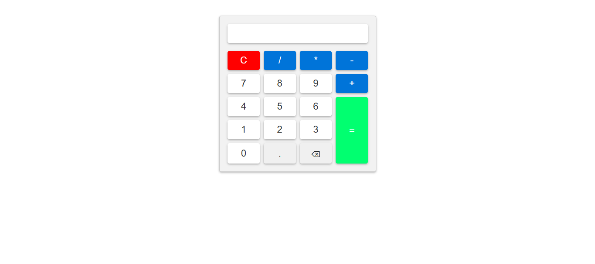
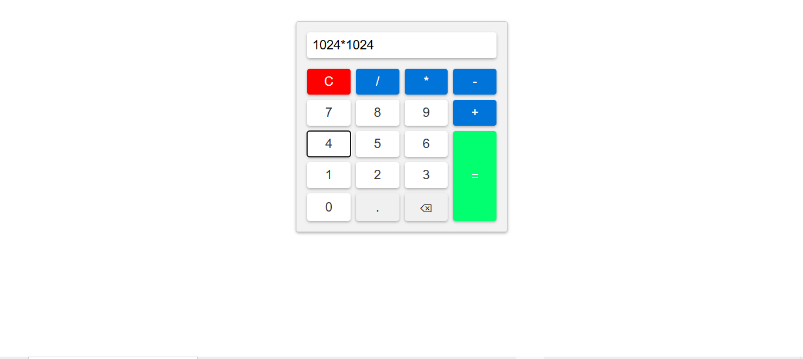

# 🧮 Basic Calculator

<div align="center">

A clean, responsive, and user-friendly **Basic Calculator** built with **HTML**, **CSS**, and **JavaScript**.

This project performs standard arithmetic calculations while demonstrating core JavaScript concepts such as DOM manipulation, event handling, functions, loops, and dynamic user interaction.


</div>

---

## 🌐 Live Demo

🔗 https://labibahmedrafi.github.io/basic-calculator/

> The live demo will be available after enabling GitHub Pages.

---

## 📸 Screenshots

### Home Screen



---

### Performing Calculation



---

## ✨ Features

- Basic arithmetic operations
- Addition (+)
- Subtraction (-)
- Multiplication (×)
- Division (÷)
- Decimal number support
- Backspace functionality
- Clear all input
- Responsive layout
- Clean and simple user interface

---

## 🛠 Built With

| Technology | Purpose |
|------------|---------|
| HTML5 | Structure |
| CSS3 | Styling |
| JavaScript (ES6) | Calculator Logic |

---

## 📂 Project Structure

```text
basic-calculator/
│
├── index.html
├── style.css
├── script.js
├── README.md
├── LICENSE
├── .gitignore
└── screenshots/
    ├── home.png
    └── calculation.png
```

---

## 🚀 Installation

Clone the repository:

```bash
git clone https://github.com/labibahmedrafi/basic-calculator.git
```

Navigate into the project:

```bash
cd basic-calculator
```

Open `index.html` using **Live Server** in Visual Studio Code.

---

## ⚙️ How It Works

1. Click the number buttons to enter values.
2. Choose an arithmetic operator.
3. Continue entering numbers.
4. Press **=** to calculate the result.
5. Press **⌫** to delete the last character.
6. Press **C** to clear the display.

---

## 📈 Future Improvements

- Keyboard support
- Scientific calculator mode
- Calculation history
- Dark mode
- Percentage operator
- Square root
- Exponent operation
- Memory functions (M+, M-, MR, MC)
- Theme customization

---

## ⚠ Known Limitations

- Uses JavaScript's `eval()` function for expression evaluation.
- Does not currently validate malformed mathematical expressions.
- Division by zero follows JavaScript's default behavior (`Infinity`).

---

## 📄 License

This project is licensed under the **MIT License**.

---

## 👨‍💻 Author

### Md. Labib Ahmed Rafi

Computer Science & Engineering Student

GitHub:

https://github.com/labibahmedrafi

---

## ⭐ Support

If you found this project useful, consider giving it a ⭐ on GitHub.

It helps support future development and makes the project easier for others to discover.